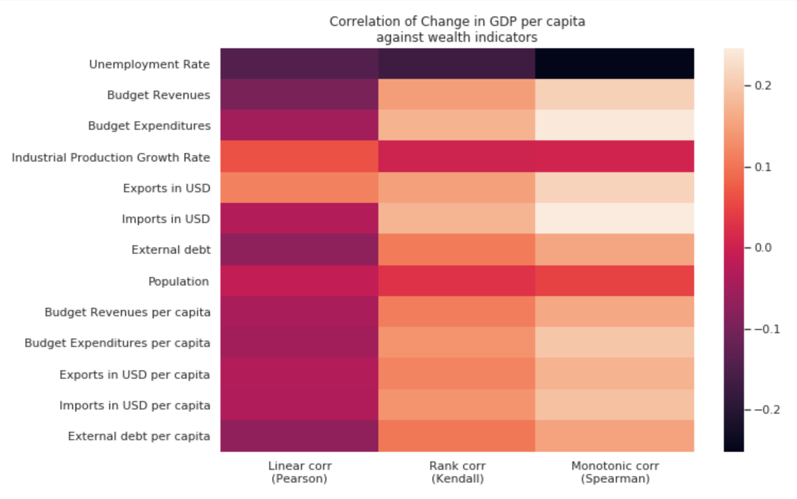
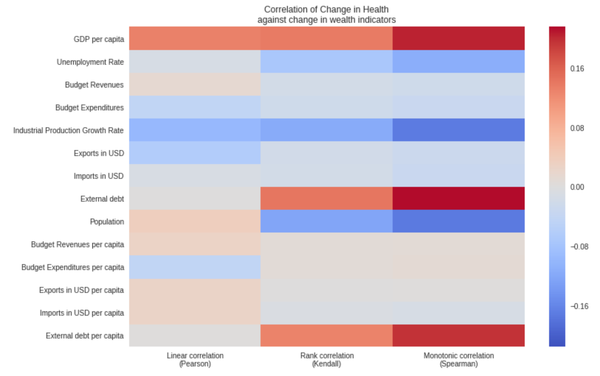
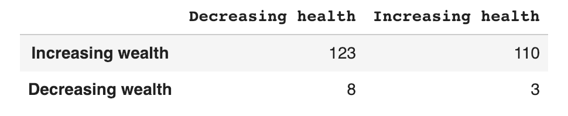
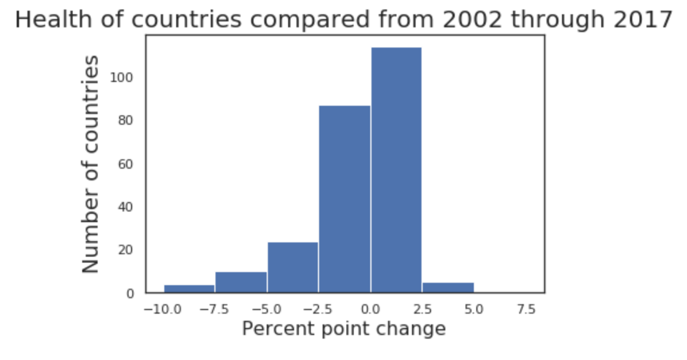
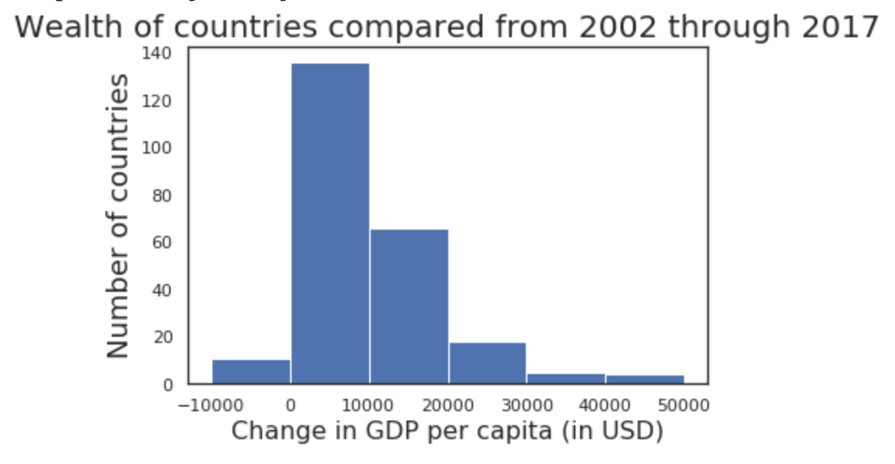
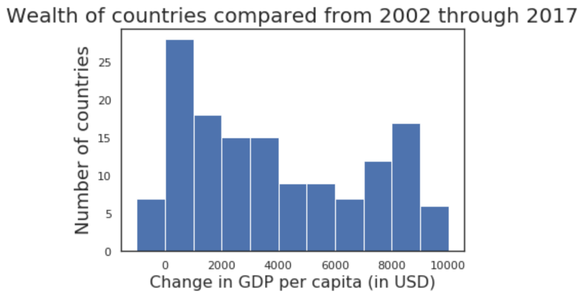
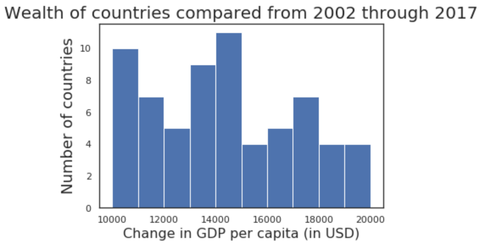

Which countries are going to be prosperous? How are they faring today? Do they need a hand joining the ranks of the developed countries? How do we help them? To answer these questions, we need data. Let's turn to the [CIA factbook](https://www.cia.gov/library/publications/the-world-factbook/) for data.

# Which countries are going to be prosperous?

This image shows the correlations between the GDP per capita of a country against indicators that could affect this GDP.  The higher the correlation, the stronger the effect.  The indicators with the highest correlations (around 0.25 in this figure) are:
  * Exports
  * Imports
  * Budget Expenditures

Notice that the Exports per capita, and Imports per capita are not as high.  They are calculated by dividing the Exports by the Population. If the GDP per capita increased, and the Exports increased, but the Population increased more, the correlation will be less.

There are three columns of correlations in this figure. Linear correlation values are higher when a unit change in one indicator always has the same fixed change in the other.  They move in lock-step.

The rank correlation is calculated by:
  * sorting one indicator (thus ranking it), and
  * comparing it to how sorted the second indicator looks

Monotonic correlation is higher if both indicators rise together at different rates. Think of this as sorting the first indicator, and checking if the second was also sorted at each index of the first.

The world is a very complicated place - especially when it comes to analyzing countries. It's surprising that even then we found some correlation. A correlation of 0.25 is not amazing, but it is still surprising.

Now the question is, how significant is such a correlation? For this, we turn to Welch's t-test. This test returns two numbers: a statistic, and a p-value. The statistic tells us which indicator has a higher mean value. The p-value tells us by resampling the same data over and over, how often we would find the mean values farther apart than the statistic. A p-value of 0.01 means we will find the mean values within the statistic range 0.99 out of 1.00 times, or 99% of the time.
Welch's t-test provided these values:
Budget Revenues (statistic: -1.8, pvalue: 0.065)
Exports (statistic: -3.5, pvalue: 0.0005)
Imports (statistic: -1.8, pvalue: 0.073)

A p-value of 0.0005 is definitely significant. So we can say Exports definitely affect the GDP per capita of a country. The other two values are close to the usual threshold of 0.05 we prefer, but they're a little more than that. Should we discount these two indicators? I think maybe it depends on what area you're applying the p-value to. For medical research a p-value of 0.01 or lower is preferred. For other conditions 0.05 or lower is preferred. For a messy case like comparing countries, 0.07 should be fine. I would consider Budget Revenues and Imports as significant.

## Interpretation

Wealth of a nation is a zero-sum game. You can buy goods from someone else within your country, and money just changes hands. The wealth of the nation has not increased because of it.

The only way to increase a nations' wealth is to provide goods and services to other nations. Exports make a nation wealthier.

Companies invest this incoming revenue locally to get better efficiencies. Better efficiencies will allow them to keep more of what they earn from their trade. We don't have an indicator of efficiencies in our dataset.

Companies spend on industrial equipment from developed countries to increase their efficiency. This is why Imports are linked to a nations' wealth. When you earn more, you're taxed more by the government. This is why the government Budget Revenues are correlated with the nations' wealth.

# Which countries are going to be healthy?

Change in Health has the most positive correlation with the GDP per capita (around 0.2). It even has some linear correlation (around 0.1).

All other correlations show up as Monotonic correlations.

The External debt has a 0.2 correlation with change in health. A country borrowing from others is probably spending some of its money on its citizens health. This is the same with External debt per capita.

The Population has a negative correlation with change in health (around 0.2). If your population is growing, the amount of money you can spend per person for health is decreasing.

Industrial Production growth rate is also negatively correlated with health (around 0.2). This is not surprising given that our health indicators are:

  * Infant mortality rate plus. With parents going to work, there will be less focus on children.

  * HIV/AIDS prevalence rate in adults. More people working together means more chances of relationships and more chances of HIV transmission.
# How are countries faring?
This is how the overall health and wealth of countries looks like:

Notice that most countries are showing increases in wealth.

Health data at the CIA factbook site was only for:
  * Infant mortality rate
  * HIV/AIDS prevalence in adults
Of course that is not all there is.  The developed countries face obesity related heart disease and diabetes. This data was not available to us. What does the change in health of countries look like?

Even in just those two health categories, half of the countries are losing health.  If their health is decreasing, and their wealth is increasing, are they trading health for wealth? More data is needed to find out.

Let's dig into the wealth data to see how it is spread across countries.

Almost all countries are showing an improvement in wealth.  Let's dig deeper into the middle two large blocks to see how the countries are distributed.

Looks like an almost even distribution. Now for the countries in the 10000 USD to 20000 USD range:

Again an even distribution.

There's nothing much to think about here. All countries are getting wealthier even if half of them are getting unhealthy.

